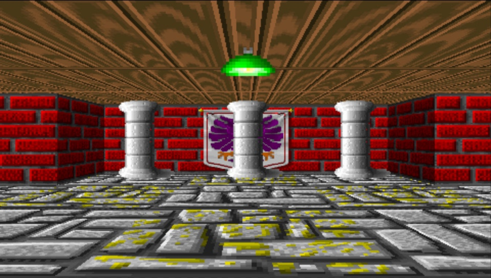

# Raycaster

## Introduction
Raycaster example made based on Lode Vandevenne examples. This is a Visual Studio Code project using MINPSP Windows SDK.
It uses the [gLib2D by Geecko](https://github.com/libcg/gLib2D) modified by me for CPP and changed some other things.

## Screenshots


## Project structure
```
.src/ # your main project source
.res/ # any asset, such as PSP icon, background etc
.lib/ # any 3rd party lib
Makefile # the makefile required to build your program
```

## Requirements
* [MINPSP for Windows](https://sourceforge.net/projects/minpspw/files/latest/download)
* [Visual Studio Code](https://code.visualstudio.com/)
* [Microsoft C/C++ VSCode extension](https://marketplace.visualstudio.com/items?itemName=ms-vscode.cpptools)
* PSP with a CFW installed or [PPSSPP](https://www.ppsspp.org/) emulator.

## How to start
- Install MINPSP, VSCode and C/C++ extension from the Requirements section.
- Clone or download this repository.
- Set *.PBP in Windows to automatically open with PPSSPP
- Inside root project folder, execute `run.bat` to generate the EBOOT.PBP and test the game in the emulator.
- If you want to clean the generated binaries, use `make clean`.

## TODO
- Performance
